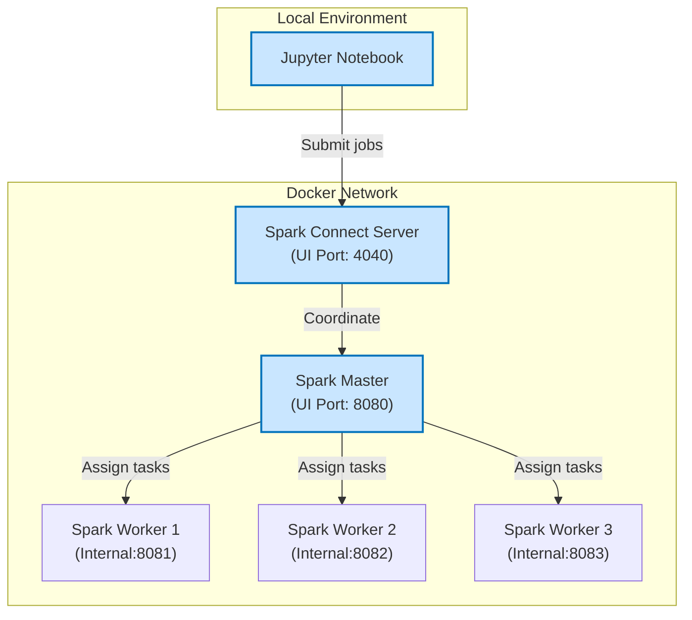

# Spark Server

This repository contains a Docker-based setup for a Spark cluster, designed for local development

## Getting Started

### Build and Run

```bash
docker-compose up -d
```

## Architecture



The Spark cluster consists of the following components:

- **Jupyter Notebook** - Interactive development environment with PySpark support
- **Spark Connect** - Provides a server for remote Spark clients
- **Spark Master** - Coordinates resource allocation and job scheduling
- **Spark Workers** - Execute the actual computation tasks


You can access these components through your browser:
- **Spark Master UI**: http://localhost:8080
- **Spark Connect UI**: http://localhost:4040

The locally running Jupyter notebook connects to the containerized Spark cluster through the Spark Connect server for job submission and execution.